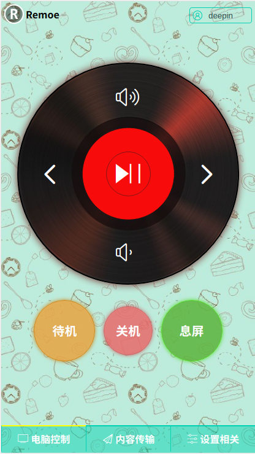

**简介**

linux平台轻量级的局域网电脑控制软件，通过扫码，在手机浏览器页面上对电脑进行控制。

**主要功能**

网易云音乐播放控制、关机、待机、息屏、文字和文件的双向传输

**说明**

软件默认的匹配码为“deepin”，可以修改，只有手机浏览器页面上的匹配码与电脑端的一致才能控制。
双击电脑端文字提示框，可以切换mini模式和普通模式。在mini模式下，右击软件界面退出程序。

**文字和文件传输使用说明**

1. 电脑文字传到手机：在电脑上复制文字到剪贴板，然后在手机浏览器上点击“获取剪贴板内容”，文字会显示在页面的输入框中。

2. 手机传文字到电脑：在浏览器的“内容传输”页面的输入框中输入文字，点击“传文字到剪贴板”，电脑的剪贴板即会获得该文字。

3. 电脑文件传到手机：在电脑上复制单个文件，然后在手机浏览器上点击“获取剪贴板内容”，浏览器即会提示下载。

4. 手机文件传到电脑：先在手机浏览器上点击“点击选择文件”按钮，选择文件后，点击”上传所选文件“按钮即可。默认是上传到~/Downloads目录，可在设置页面设置将文件上传到桌面。由于手机浏览器不同，有的浏览器可以上传多个文件，有的一次只能上传一个文件，有的可以拍照上传。

**依赖（可以直接忽略，按下面方法安装）**

* tkinter
* flask
* qrcode
* PyUserInput
* setproctitle

**软件安装**
1. `git clone https://github.com/denjay/remote.git`
2. `cd remote`
3. `./install.sh`

**截图**

